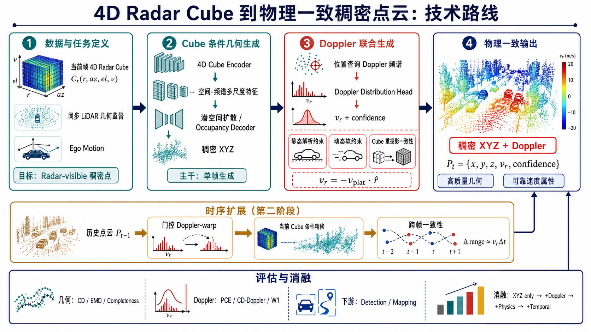

# 顶会工作计划：从 4D Radar Cube 生成物理一致的稠密 4D 点云

> 版本：2026-07-16  
> 目标：CVPR / ICCV / NeurIPS 等视觉与机器学习顶会  
> 论文主线：**当前帧 4D Radar Cube -> 稠密 `XYZ + Doppler` 点云**  
> 第二阶段扩展：历史点云经门控 Doppler-warp 后，作为当前 Cube 生成的时序先验  
> 关联材料：[proposal.md](proposal.md) · [draft_method.md](../paper/draft_method.md) · [技术路线图](assets/cube_to_dense_technical_roadmap.png)

> **2026-07-18 证据修订（不追溯修改原门槛）：**修复版 G0 已以 100/100 帧、11/11 检查通过；G1 preflight 已通过并正在运行三种子正式对照。独立静态 Doppler 审计在 validation 上失败且有界 SNR recovery 未恢复，因此 E5 与“解析静态先验”贡献已移除，E3/E4 继续。G4 的 2,160 帧 manifest 已通过，官方数据断点下载中；P5 test 在 G4 family 冻结前保持锁定。当前主张状态见 [claim_evidence_ledger.md](../paper/claim_evidence_ledger.md)。

> **2026-07-19 G1 终局：**三种子有界恢复仍失败。RAE-Max 的 Chamfer 为 `2.9306 m`，但 outlier `25.697%` 略高于固定 `25%` 门；Full-RAED 相对 RAE-Max 的 Chamfer 恶化 `5.86%`，95% CI 为 `+0.78%` 到 `+14.69%`。原始 G1 与 G2/G3 正式关闭，C1 早融合主张否决。只继续独立 G1B 物理压缩频谱候选；若其三种子 Stage B 通过，才可作为新命名 RaLD-anchor late-fusion 分支的冻结几何父模型。

> **2026-07-19 基线修订：**官方 RaLD checkpoint 因 ColoRadar 域、强度-only 条件和无逐点 Doppler/confidence 输出，不作为 K-Radar 主表公平基线。完整规模的 K-Radar matched 重实现通过了结构与梯度验证，但单帧 AE 在一次预注册 hard-occupancy 修复后仍未通过 Chamfer 门（`9.1444 m` vs `<=5.0 m`），因此独立 point-VAE/latent-EDM 训练链 no-go，不进入主表；RaLD 的 radar-token hierarchy、mixed set latents、latent Transformer 和 query decoder 转入后置 anchor-refinement 主线。

> **2026-07-19 RaLD 主线借鉴修订：**matched baseline no-go 不等于放弃 RaLD。当前已实现并在 H200 通过 `RaLD-anchor-hybrid` RH0：完整 64-bin RAED 编码为 336 radar tokens，现有 occupancy top-10k 作为长量程 anchors，RaLD 的 512 mixed latents 与 query cross-attention 负责连续位置、Doppler distribution 和 confidence 精修。独立 point VAE 因长量程 Chamfer 门失败已关闭，避免机械复制短距 ColoRadar 配置。



---

## 1. 论文目标与核心判断

### 1.1 研究问题

给定当前帧完整 4D Radar Cube

```text
C_t ∈ R^(R × A × E × V)
```

其中四个坐标分别表示 range、azimuth、elevation 和 Doppler，生成雷达可观测的稠密点云

```text
P_t = {(x_i, y_i, z_i, v_r,i, c_i)}_(i=1)^N,
```

其中 `v_r,i` 为逐点径向速度，`c_i` 为雷达可见性或预测置信度。输出既要具有接近同步 LiDAR 的空间完整性，又要与输入 Cube 的速度谱、自车运动和跨帧径向位移保持物理一致。

### 1.2 核心论文命题

> 稠密雷达点云生成不能只恢复空间几何。完整 4D Radar Cube 中的 Doppler 频谱提供了与运动直接相关的观测，生成点的位置、速度和可见性应在统一模型中联合推断，并通过 Cube-to-point 与 point-to-Cube 的双向一致性进行约束。

### 1.3 最可防守的创新边界

1. **完整 RAED Cube 条件生成**：保留 Doppler 轴，不将输入提前压缩为普通 RAE 强度张量。
2. **稠密 `XYZ + Doppler + confidence` 联合输出**：在恢复高质量几何的同时，为每个生成点估计速度分布及可靠性。
3. **Cube-point 双向物理闭环**：由 Cube 生成点云，再将生成点可微重投影回 Cube，约束空间位置和 Doppler 频谱共同自洽。
4. **解析静态项与学习动态项分解（候选已否决）**：该候选需要稳定的跨分区静态 Doppler 约定；当前 validation 未优于 circular-random，故 E5 已移除，不能作为当前创新。
5. **当前观测主导的时序生成**：历史点云仅提供 Doppler-warp 先验，当前 Cube 负责补点、纠错和刷新 Doppler，区别于简单历史点聚合。

### 1.4 不应作为核心创新的表述

- “首次从雷达生成稠密点云”：已有相关生成方法。
- “首次使用 Doppler”：检测、场景流和时序聚合工作已经使用 Doppler。
- “给点云增加一个速度通道”：若没有频谱监督和双向闭环，只是增量式结构修改。
- “历史点云经 Doppler 补偿后聚合”：DoppDrive 已覆盖这一任务形态。

---

## 2. 与现有工作的关系

| 方法类别 | 输入 | 输出 | 已有能力 | 本工作的新增部分 |
|---|---|---|---|---|
| RaLD 类方法 | 单帧 RAE radar spectrum | 稠密 `XYZ` | 高质量空间生成 | 保留 Doppler 轴，联合输出速度，加入 Cube-point 闭环 |
| DoppDrive 类方法 | 多帧稀疏 `XYZ+Doppler` | 移动和筛选后的聚合点 | Doppler 驱动时序增密 | 由当前 Cube 生成新点并刷新速度，而非只复用历史点 |
| 当前仓库单帧线 | LiDAR | 384 点 `XYZ+Doppler+RCS` | 点生成、ego 条件、物理损失 | 输入方向和稠密目标需要重做 |
| 当前仓库时序线 | 上一帧稀疏雷达点 | 下一帧稀疏雷达点 | Doppler-warp、桥式生成、scheduled sampling | 作为第二阶段时序先验复用 |

---

## 3. 方法设计

### 3.1 模块 A：4D Cube 数据表征与编码

输入保持完整 `R × A × E × V` 结构。首轮至少实现三种编码对照：

- `RAE-Max`：沿 Doppler 轴取最大值，作为不保留速度谱的基线。
- `RAE-Moments`：保留强度、速度均值和速度方差等低阶矩。
- `Full-RAED`：显式编码完整 Doppler 频谱，作为主模型。

Cube Encoder 输出空间对齐的多尺度特征 `F_t`。若显存不可接受，按优先级尝试 Doppler 低秩分解、稀疏峰值 token、局部窗口注意力，不在第一版直接使用全局四维注意力。

### 3.2 模块 B：稠密几何生成

当前 frustum occupancy 网络既是 G1 诊断基线，也是候选主方法的冻结长量程
anchor 分配器。独立 RaLD point VAE/EDM 已因 K-Radar 长量程 Chamfer 门失败而
关闭；当前候选方法采用 RaLD 的 Full-RAED radar tokens、mixed set latents 和
implicit query decoder：

```text
Full-RAED tokens + top-10k parent anchors
    -> mixed latent cross-attention
    -> anchor query decoder
    -> {continuous p_i, q_i(d), c_i}
```

目标点应定义为 **radar-observable dense points**，而不是无条件复制全部 LiDAR 表面。同步 LiDAR 提供几何监督，Cube 能量、视场、遮挡和距离共同构造可见性 mask。

RaLD 提供 radar-token 条件、全局集合潜空间与 query decoder。本方法保留冻结
occupancy parent 的长量程 anchors，并在 query decoder 后新增局部 Cube 频谱
残差头，联合输出连续位置、64-bin Doppler distribution 与 confidence，再通过
point-to-RAED cycle 约束。主方法禁用 RaLD 的 CFAR query helper。

父模型选择不改写 G1：若 G1 正式通过，使用 Full-RAED occupancy parent；若 G1
失败但 RAE-Max 独立通过固定 CFAR 几何门，仅允许在新命名 `G1R/RH` late-fusion
分支中冻结 RAE-Max anchors，再通过 RaLD Full-RAED tokens 注入频谱上下文。若
两个原始几何臂均未通过门槛时，RH1/RH2 等待独立 G1B 正式候选。G1B
通过后只能以 `independent_g1b_parent` 接入，不能改写原始 G1，也不能解锁
原 G2/G3。

独立 RaLD point VAE 在 K-Radar 长量程 one-frame 门控中未通过 Chamfer，故不
直接替换几何父模型。当前采用 `RaLD-anchor-hybrid`：frustum occupancy 负责
长量程 anchor，RaLD mixed latent 与 query cross-attention 负责全局集合建模和
物理属性精修。协议见
[`rald_anchor_hybrid_protocol.md`](rald_anchor_hybrid_protocol.md)。

主要损失：

```text
L_geo = λ_cd L_CD + λ_occ L_occupancy + λ_conf L_confidence
```

### 3.3 模块 C：逐点 Doppler 分布生成

将生成位置 `p_i` 投影到雷达极坐标 `π(p_i)`，在对应 Cube 空间邻域查询 Doppler 频谱：

```text
q_i(v) = Softmax(H(F_t, π(p_i)))
v_hat_i = Σ_v v · q_i(v)
```

模型同时预测 `confidence_i`，对多峰、弱反射和不可观测位置显式表达不确定性。优先使用速度分布 NLL 或交叉熵，而不是只做标量 L1 回归。

### 3.4 模块 D：解析静态项与动态残差（已关闭候选）

静态背景满足：

```text
v_r^static(p) = -v_plat(p) · r_hat
v_plat(p) = v_ego + ω × (p + t_s)
```

最终速度分解为：

```text
v_r = v_r^static + v_r^dynamic
```

该分解依赖稳定的静态 Doppler 符号和自车运动约定。validation 审计未通过，
因此当前 RH/G2R/G3R 不启用解析静态损失、static PCE 门或 ego-speed
counterfactual；后续只有在独立标定协议通过后才能作为新候选重开。

### 3.5 模块 E：可微 point-to-Cube 重投影

构造可微渲染器：

```text
C_hat_t = R({p_i, v_r,i, confidence_i})
L_cycle = D(C_hat_t, C_t)
```

渲染器至少在 `range-azimuth-elevation-Doppler` 网格上进行软 splatting，并使用预测 confidence 作为能量权重。第一版只要求重建归一化局部频谱或稀疏峰值分布，不强行恢复原始复数 IQ 信号。

该模块是论文最关键的区别点，必须通过消融证明它同时改善以下至少两项：

- Doppler 频谱匹配；
- 逐点速度物理一致性；
- 几何位置准确性；
- 下游检测或速度估计。

### 3.6 模块 F：时序扩展

单帧主干稳定后，再加入：

```text
P_(t-1)
  -> 门控 Doppler-warp
  -> 当前帧几何先验
  -> 与 C_t 特征融合
  -> 当前帧稠密 P_t
```

跨帧约束：

```text
L_temp = |Δrange - v_bar_r Δt|
```

保留单帧 Cube 模型、ego-only warp、DoppDrive 式聚合和当前仓库 `copy_dopp` 作为对照。历史帧不能替代当前 Cube，避免任务退化为确定性点云聚合。

### 3.7 总目标

```text
L = L_geo
  + λ_spec L_doppler-spectrum
  + λ_cycle L_cube-cycle
  + λ_temp L_temporal
```

采用分阶段训练，禁止从第一天同时打开全部损失。每新增一个模块都必须在固定基线上做独立消融。

---

## 4. 数据与任务协议

### 4.1 必需数据字段

- 同步或可精确配准的 4D Radar Cube 与 LiDAR；
- 雷达内外参、时间戳、ego pose、线速度和角速度；
- Doppler bin 到 m/s 的标定关系及符号口径；
- 可选：3D 框、类别、目标速度、跟踪 ID；
- 可选：已有 CFAR 点云，用于验证 Cube 读取和 Doppler 映射。

### 4.2 数据审计必须回答的问题

1. Cube 的真实维度顺序、数值类型和物理单位是什么？
2. Doppler 是否存在混叠、静态杂波抑制或预补偿？
3. Cube 与 LiDAR 的时间差和空间标定误差是多少？
4. 一个 LiDAR 点在 Cube 中是否有稳定可查询的局部频谱？
5. 哪些 LiDAR 表面属于雷达可观测区域，如何构造置信 mask？
6. 数据划分能否按场景隔离，避免相邻帧泄漏？

### 4.3 输出规模

首轮建议固定 `N=10,000` 便于与 RaLD 类方法对齐；后续比较 `N=5k/10k/20k`。同时报告真实有效点数和 confidence 校准，避免仅靠增加低质量点改善覆盖率。

---

## 5. 实验矩阵

### 5.1 主实验组

| ID | 方法 | 研究问题 | 论文位置 |
|---|---|---|---|
| E0 | CFAR / 原始稀疏点 | 原始传感器下限 | 主表 |
| E1 | RAE-Max -> dense XYZ | 不使用 Doppler 轴的几何基线 | 主表 |
| E2 | Full-RAED -> dense XYZ | Doppler 频谱是否帮助几何 | 主表、消融 |
| E3 | E2 + Doppler scalar head | 简单增加速度头的效果 | 消融 |
| E4 | E2 + Doppler distribution head | 分布预测是否优于标量回归 | 主表、消融 |
| E5 | E4 + static/dynamic physics | 预注册候选，静态审计失败后取消 | 负结果/附录 |
| E6 | E4 + Cube cycle | 双向闭环是否带来核心增益 | 核心消融 |
| E7 | E6 + temporal prior | 历史先验是否提升稳定性 | 时序表 |

### 5.2 必须包含的基线

- CFAR 或数据集官方点云提取结果；
- RaLD 相关工作与 matched no-go 证据；官方 checkpoint 不做不公平迁移，matched AE 不继续 EDM 或进入定量主表；
- SDDiff / RPDNet 等可获得的雷达稠密化基线；
- 标量 Doppler 回归基线；
- DoppDrive 式多帧聚合；
- ego-only aggregation 与当前仓库的 gated Doppler-warp；
- Oracle：使用 GT 目标速度或 GT 运动 mask，测量物理模块上限。

### 5.3 指标

**几何质量**

- Chamfer Distance、EMD、F-score；
- precision、recall、completeness；
- 按距离区间统计的完整度和定位误差；
- 有效点数、重复点率、离群点率。

**Doppler 与物理一致性**

- PCE、CD-Doppler、W1(`v_r`)；
- Cube Doppler spectrum NLL / KL；
- 静态和动态子集分别统计速度误差；
- confidence calibration：ECE、NLL 或 reliability curve；
- 反事实 ego-speed 剂量响应。

**时序质量**

- `|Δrange - v_bar_r Δt|`；
- 多步 rollout CD 与 PCE；
- 点云 flicker、轨迹连续性、速度刷新率；
- 与单帧、ego-only、DoppDrive 聚合比较。

**下游价值**

- 3D object detection；
- 径向速度或目标速度估计；
- localization / mapping，若数据和时间允许。

### 5.4 统计协议

- 按场景划分 train/val/test；
- 至少 3 个随机种子用于主模型与关键消融；
- 报告均值、标准差和配对显著性检验；
- 所有阈值在验证集确定，测试集只评估一次；
- 每张主表同时报告几何和 Doppler，禁止只展示单一有利指标。

---

## 6. 分阶段执行计划

### P0：任务与数据可行性审计（W1-W2）

**任务**

- 完成 Cube schema、标定、时间同步和 Doppler 口径核查；
- 建立 `Cube -> CFAR point` 可视化与数值自检；
- 将 CFAR 点投回 Cube，验证空间 bin 和 Doppler bin 对齐；
- 定义 radar-observable LiDAR target 与 confidence mask；
- 固化场景级数据划分。

**产出**

- Cube loader、字段报告、同步误差报告；
- 100-500 帧可视化审计集；
- 数据协议文档和最小缓存格式。

**G0**

- Cube、LiDAR、ego motion 能稳定同步；
- CFAR 点回查 Cube 后空间与 Doppler 对应关系正确；
- radar-observable target 可以稳定构造。

若 G0 不通过，不进入大模型训练。优先修数据口径；若数据本身缺少完整 Doppler 轴或同步 LiDAR，则必须缩小论文命题。

### P1：单帧稠密几何基线（W3-W5）

**任务**

- 实现 `RAE-Max -> dense XYZ`；
- 实现 Full-RAED Cube Encoder；
- 建立 frustum occupancy 或 point-latent decoder；
- 对齐 CFAR、RaLD 风格基线和 LiDAR GT；
- 完成距离分层几何评估。

**产出**

- 可复现 Cube-to-XYZ 基线；
- 主表中的 E0-E2；
- 第一版定性结果和失败案例。

**G1**

- 稠密输出在 CD/F-score/completeness 中稳定优于 CFAR；
- Full-RAED 至少在一个几何指标或远距离子集上优于 RAE-Max；
- 输出不是通过大量重复点或离群点获得虚假覆盖率。

**终局状态：失败。** Full-RAED 未通过相对 RAE-Max 的几何非退化门，RAE-Max
也未通过固定 CFAR outlier 门。后续工作不再以 G1 成功为前提；独立 G1B 与
RaLD-anchor RH 使用新的命名、父模型选择和证据链。

### P2：Doppler 联合生成（W6-W8）

原 E3-E5/G2 队列因 G1 失败已关闭。只有独立 G1B 与 RH2 都通过后，才建立
`G2R`：在同一冻结 RaLD-anchor family 内比较 scalar、distribution 与 direct
Cube spectrum query，不能复用未运行的原 G2 编号或结论。

G2R 中 RaLD 不是冻结特征提取器：Full-RAED token encoder、static/dynamic mixed
latents、latent Transformer 与 query decoder 全部参与优化。两个学习臂均关闭
cycle，从相同种子初始化；先做 5 epoch physical-head warmup，再做 25 epoch joint
training。direct query 必须在生成点最终连续 RAE 位置计算，避免位置不一致的伪
对照。

**任务**

- 实现位置条件 Doppler spectrum query；
- 完成 scalar head 与 distribution head 对照；
- 复用 ego-conditioned static loss；
- 加入动态残差和 confidence 校准；
- 运行速度反事实实验。

**产出**

- E3-E5 消融；
- Doppler 主表、可靠性曲线、静动态分解图。

**G2**

- distribution head 稳定优于 scalar head；
- 物理约束改善 PCE 和频谱指标，几何 CD 相对退化不超过预注册容忍区间；
- 动态速度分布不发生“全静态”塌缩。

### P3：Cube-point 双向闭环（W9-W11）

原 G3 队列未获授权。若 `G2R` 通过，则以同一冻结 family 建立 `G3R`，重新运行
no-cycle、local-peak、marginal 与 full-cycle 消融，并保留原 anti-collapse 门槛。

四个 G3R 臂必须从每个种子对应的 G2R distribution `best.pt` 同时分叉，禁止从
已经接受 full-cycle 训练的 RH2 checkpoint 初始化。每臂固定 20 epoch，唯一允许
变化的训练配置是 cycle variant。

**任务**

- 实现可微 RAED soft splatting renderer；
- 设计局部峰值、边际分布和完整 Cube 三种 cycle loss；
- 检查模型是否通过降低 confidence 逃避重建；
- 做频谱噪声、Doppler 混叠和标定偏差鲁棒性实验。

**产出**

- E6 核心消融；
- 生成点与输入 Cube 对应关系可视化；
- 核心方法图和机制分析图。

**G3：论文关键门**

Cube cycle 必须在 Doppler 频谱匹配、PCE、几何或下游任务中至少改善两类指标，并且不能通过置信度坍缩获得。若未达到，论文退化为“RaLD + Doppler head”，不具备足够强的顶会差异化，应停止扩规模并重新设计闭环。

### P4：时序先验扩展（W12-W14）

当前 G4 队列硬依赖已关闭的原 G2/G3 summary，不能直接继续。只有新的单帧
family 依次通过 G1B、RH、G2R/G3R 并冻结后，才可重建 `G4R` 时序队列；已下载
的时序数据与固定 split 可继续复用。

**任务**

- 从通过 G3R 的三种子 `full` checkpoint 原样初始化，并用零门控证明每个
  temporal arm 在 step 0 精确复现单帧 RaLD 输出；
- 以 ego pose-only warp 作为主先验，不重新引入已否决的解析静态 Doppler
  约定；原始 Doppler 位移仅作为 sensitivity baseline；
- 比较三个 RaLD-native 注入位置：336 radar-token hierarchy、dynamic mixed
  latents 和 decoded anchor queries；
- 保留当前 Full-RAED Cube、RaLD static/dynamic mixed latents、latent
  Transformer、query cross-attention 与 final-position Cube spectrum query；
- 复用 scheduled sampling 处理 rollout 分布偏移；
- 与单帧 G3R、ego-only 历史聚合和 raw-Doppler-displacement sensitivity
  baseline 比较。

**产出**

- E7 时序结果；
- 长序列可视化；
- 时序稳定性和失败边界分析。

**G4**

时序模型必须改善单帧 G3R 的 ego-aligned matching/flicker，并优于历史聚合
baseline 的当前帧几何和局部 Doppler 分布。Chamfer 相对单帧不得恶化超过
2%，局部 circular KL/W1 不得恶化超过 5%，25-step rollout 的 confidence 和
coverage 保留率均须至少 90%。若只改善平滑度而损伤当前帧准确性，则将时序
模块降为 appendix，不影响单帧主线投稿。

### P5：规模化、下游与泛化（W15-W17）

**任务**

- 全量训练和至少 3 个随机种子；
- 跨天气、距离、速度、目标类别和场景分析；
- 检测、速度估计和可选 mapping；
- 运行效率、显存和推理速度统计；
- 完成失败案例分类。

**产出**

- 最终主表、鲁棒性表、效率表；
- 定性主图和补充视频素材；
- 完整 checkpoint 与评估脚本。

### P6：论文整合与内部评审（W18-W20）

**任务**

- 先完成 method、experiments、analysis，再写 introduction 和 abstract；
- 完成至少两轮独立内部审稿；
- 将主要 reviewer objection 映射到实验或限制；
- 主文控制在一个核心命题，时序结果不抢占 Cube-point 闭环主线；
- 整理代码、配置、数据协议和 supplementary。

**冻结标准**

- 每个贡献点至少有一个主表或主图支撑；
- 主结果包含强基线、完整消融和统计波动；
- 所有“首次”表述完成投稿前文献复扫；
- 没有尚未解决的数据泄漏、单位口径或评估不公平问题。

---

## 7. 当前仓库的复用与重构

### 7.1 直接复用

- `losses/physics.py`：静态自门控、动态一致性；
- `eval/physics.py`：PCE；
- `eval/gen_metrics.py`：CD-Doppler、MMD、JSD，可扩展到 dense protocol；
- `temporal_pairs.py`：门控 Doppler-warp 逻辑；
- `train_bridge_ss.py`：scheduled sampling 思路；
- 反事实 ego-speed 评估和 rollout 评估框架。

### 7.2 需要替换

- PCD-only loader -> 4D Cube loader；
- LiDAR condition encoder -> Cube Encoder；
- 固定 384 点稀疏目标 -> 5k-20k radar-observable dense target；
- LiDAR-to-radar 单帧任务 -> Cube-to-dense-4D 任务；
- 稀疏 radar-vs-radar 指标 -> dense geometry + spectral Doppler 协议。

### 7.3 需要新增

- Cube/LiDAR 配准与 observability mask；
- Full-RAED 多尺度编码器；
- 稠密点或 frustum occupancy 解码器；
- Doppler distribution head；
- differentiable point-to-Cube renderer；
- confidence calibration 与 spectrum-level metrics。

---

## 8. 顶会审稿风险与应对

| 审稿质疑 | 风险 | 必须准备的证据 |
|---|---|---|
| “只是 RaLD 加速度头” | 高 | Full-RAED vs RAE、scalar vs distribution、Cube cycle 核心消融 |
| “只是 DoppDrive 加生成器” | 高 | 当前 Cube 条件、生成新点、速度刷新和优于聚合的下游结果 |
| “LiDAR 点没有真实 Doppler” | 高 | radar-observable target、Cube 频谱监督、confidence 和可见性分析 |
| “物理约束让模型全部预测静态” | 高 | 静动态分开指标、速度分布、动态残差和反事实实验 |
| “Cycle loss 可以靠低 confidence 作弊” | 中 | confidence 正则、覆盖率约束、校准曲线和可视化 |
| “完整 Cube 太耗算力” | 中 | 参数量、FLOPs、显存、速度及低秩/稀疏编码消融 |
| “只在单一数据集有效” | 中 | 跨场景/天气/距离分析；有条件时增加第二数据集 |
| “几何更密但对任务无用” | 高 | 检测、速度估计或 mapping 至少一项稳定增益 |

---

## 9. 论文展示计划

### 主图

1. **Figure 1**：4D Cube -> dense XYZ+Doppler 总览与 Cube-point 双向闭环。
2. **Figure 2**：生成位置查询 Doppler 频谱和 point-to-Cube renderer。
3. **Figure 3**：几何、Doppler、confidence 的定性结果与失败案例。
4. **Figure 4**：Cube-cycle 的频谱、coverage、confidence、校准与时序一致性机制分析。

### 主表

1. **Table 1**：与 CFAR 及通过独立可运行门控的 SDDiff/RPDNet 类方法比较几何和 Doppler；RaLD 仅在相关工作和 matched no-go 中说明。
2. **Table 2**：Full-RAED、scalar/distribution Doppler head 与 cycle 的完整消融；E5 仅作失败分支记录。
3. **Table 3**：时序扩展与 DoppDrive/ego-only/single-frame 对比。
4. **Table 4**：下游任务、效率和泛化。

### Appendix

- 数据标定与 observability target；
- 网络结构、训练超参数和完整指标定义；
- 更多距离/类别/天气切片；
- Doppler 混叠、噪声与 confidence 分析；
- 失败案例和伦理/数据限制。

---

## 10. 最小可发表路径与止损规则

### 最小顶会主线

```text
independently gated geometry parent
  + RaLD Full-RAED radar-token late fusion
  + dense XYZ + Doppler distribution + confidence
  + differentiable Cube-point cycle
```

时序模块不是最小主线的必要条件。若单帧闭环足够强，可以独立形成完整投稿；时序部分只在提供额外稳定收益时进入主文。

### 止损规则

- **G0 失败**：数据不支持完整 Cube、同步 LiDAR 或可靠 Doppler 标定，立即缩小命题，不投入大规模训练。
- **G1 失败（已触发）**：原 G2/G3 链永久停止；当前只进入独立 G1B，禁止放宽原门槛或把后续分支称为 G1 recovery。
- **G1B 失败**：关闭当前 occupancy geometry family，不运行 RH/G2R/G3R/G4R；下一路线必须重新提出独立协议。
- **RH 失败**：RaLD-anchor late fusion 关闭，不能仅凭 RH0 结构验证形成方法主张。
- **G2 失败**：Doppler head 不优于简单回归，重新检查频谱查询和标签定义。
- **G3 失败**：Cube cycle 没有独立贡献，停止“顶会创新已成立”的表述，重设计闭环或转为应用型工作。
- **G4 失败**：时序模块降为 appendix，不拖累单帧主线。

---

## 11. 每周执行规范

- 每周只设一个主问题和一个可证伪假设；
- 每次训练绑定 config、commit、seed、数据 split 和指标输出；
- 新模块先在小规模数据上过拟合和单元验证，再进入全量；
- 每阶段结束更新 claim-evidence 表，禁止把未完成实验写成论文结论；
- 每两周重扫一次直接竞品和引用网络；
- 主结果图表使用固定 test split，测试集不参与调参；
- 任何异常优异的物理一致性结果都必须同时检查动态占比和速度方差，防止静态塌缩。

---

## 12. 下一步行动清单

- [x] 获取并核对当前 4D Radar Cube 文件格式、维度、单位和 Doppler 口径。
- [x] 确认同步 LiDAR、ego motion、标定和场景划分是否齐全。
- [x] 实现最小 Cube loader 与单帧可视化。
- [x] 验证 CFAR 点 `XYZ+Doppler` 能否准确回查到 Cube 峰值。
- [x] 定义 radar-observable LiDAR target 和 confidence mask。
- [x] 建立 `RAE-Max -> dense XYZ` 最小基线。
- [x] 实现 Full-RAED Encoder，并启动 E1/E2 三种子正式对照。
- [x] 将 RaLD Full-RAED radar tokens、mixed set latents 与 occupancy anchors 接成可训练 RH 链，并建立 RH0.5/RH1/RH2 硬门控队列。
- [x] 关闭 G1 comparison；按冻结结果终止原 G2/G3，并归档终局负结果。
- [ ] 完成独立 G1B Stage A/B；若通过，完成 RaLD-anchor RH1/RH2。
- [ ] 在冻结 RH family 上建立并完成 G2R/G3R，不复用原 G2/G3 结论。
- [ ] 完成 G4 45/45 序列下载、CRC、时序训练与 family freeze。
- [ ] 释放 P5 test 并完成 P6 论文证据包。

> 当前最高优先级是完成 **独立 G1B -> RaLD-anchor RH1/RH2** 决策；G4 只继续数据下载与校验，不在新单帧 family 冻结前训练。
