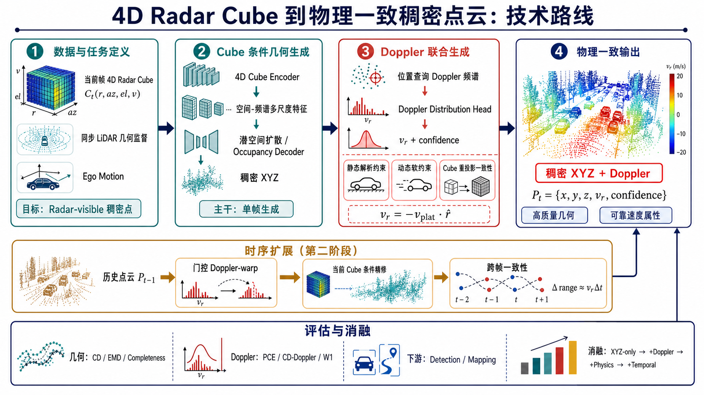

# 顶会工作计划：从 4D Radar Cube 生成物理一致的稠密 4D 点云

> 版本：2026-07-16  
> 目标：CVPR / ICCV / NeurIPS 等视觉与机器学习顶会  
> 论文主线：**当前帧 4D Radar Cube -> 稠密 `XYZ + Doppler` 点云**  
> 第二阶段扩展：历史点云经门控 Doppler-warp 后，作为当前 Cube 生成的时序先验  
> 关联材料：[proposal.md](proposal.md) · [draft_method.md](../paper/draft_method.md) · [技术路线图](assets/cube_to_dense_technical_roadmap.png)

> **2026-07-18 证据修订（不追溯修改原门槛）：**修复版 G0 已以 100/100 帧、11/11 检查通过；G1 preflight 已通过并正在运行三种子正式对照。独立静态 Doppler 审计在 validation 上失败且有界 SNR recovery 未恢复，因此 E5 与“解析静态先验”贡献已移除，E3/E4 继续。G4 的 2,160 帧 manifest 已通过，官方数据断点下载中；P5 test 在 G4 family 冻结前保持锁定。当前主张状态见 [claim_evidence_ledger.md](../paper/claim_evidence_ledger.md)。

> **2026-07-19 G1 终局：**三种子有界恢复仍失败。RAE-Max 的 Chamfer 为 `2.9306 m`，但 outlier `25.697%` 略高于固定 `25%` 门；Full-RAED 相对 RAE-Max 的 Chamfer 恶化 `5.86%`，95% CI 为 `+0.78%` 到 `+14.69%`。原始 G1 与 G2/G3 正式关闭，C1 早融合主张否决。只继续独立 G1B 物理压缩频谱候选；若其三种子 Stage B 通过，才可作为新命名 RaLD-anchor late-fusion 分支的冻结几何父模型。

> **2026-07-19 基线修订：**官方 RaLD checkpoint 因 ColoRadar 域、强度-only 条件和无逐点 Doppler/confidence 输出，不作为 K-Radar 主表公平基线。完整规模的 K-Radar matched 重实现通过了结构与梯度验证，但单帧 AE 在一次预注册 hard-occupancy 修复后仍未通过 Chamfer 门（`9.1444 m` vs `<=5.0 m`），因此独立 point-VAE/latent-EDM 训练链 no-go，不进入主表；RaLD 的 radar-token hierarchy、mixed set latents、latent Transformer 和 query decoder 转入后置 anchor-refinement 主线。

> **2026-07-19 RaLD 主线借鉴修订：**matched baseline no-go 不等于放弃 RaLD。RH/G2R/G3R 已借鉴 336 radar tokens、static/dynamic mixed queries、latent Transformer 与 query cross-attention，但它们仍是 deterministic `512 x model_dim` refiner。新增 G3L 独立门进一步采用 RaLD 核心的 `512 x 32` physical VAE、24-layer Full-RAED-conditioned EDM 与 18-step sampler；通过的 occupancy top-10k 仅作为长量程 radar-guided query initialization。失败的全空间 occupancy AE 不被重开。

> **2026-07-22 G1B 终局与 G1C 重路由：**G1B Stage A 无候选存活，Stage B、RH1/RH2、G2R/G3R 均按协议跳过。`full_raed_rank2` 的 validation median Chamfer 为 `2.0251 m`，但 mean outlier 为 `28.885%`，未达到固定 `25%` 门，不能事后放宽。当前 occupancy geometry family 正式关闭。新建独立 [`G1C RaLD-guided query`](g1c_rald_guided_query_protocol.md) 协议：不加载失败 occupancy checkpoint，直接用 Full-RAED radar-guided seeds、512 mixed latents、24-layer Transformer 和 query decoder 生成固定 10k 点。只有 G1C 三种子通过，才允许新命名的 RH-C/G2C/G3C/G3L-C/G4L-C。

> **2026-07-28 RaLD 源码审计与 G1D：**G1C 没有产生科学训练结果：首次队列因后台解释器解析失败而未启动子进程，修复后的队列仍在等待 H200 时被停止。对 RaLD 固定 commit `ffec4b4` 的逐函数审计表明，G1C 只是 deterministic set-latent residual refiner，缺少正负 occupancy query、逐层 radar condition 和 coarse-to-refine arbitrary-query 解码。因而在观察任何 G1C 指标前，新建独立 [`G1D RaLD query-field`](g1d_rald_query_field_protocol.md) 协议。G1D 才是当前最高优先级；G1C 保留为未正式训练的结构控制，不得追溯改名。

> **2026-07-28 G1D 预飞通过：**初始提交 `bd23a4f2` 通过结构预飞，但首次 seed-A 在产生任何 epoch 指标前因重复 CPU NMS 的性能审计被停止。数学等价的离散 proposal-index cache 随后加入；提交 `d0c8c6fb` 在 H200 上通过 `212` 项回归和新预飞。实测 148.37M 参数，625/9,375 正负查询、336 radar tokens、32,000/2,500/10,000 粗选与精修计数全部匹配；cache 确实启用，64 个 Cube 输入通道、64 个局部频谱列、64 个 radar projection 列和 24/24 condition blocks 在第二步均有有限非零梯度。最终预飞归档于 `artifacts/g1/g1d_preflight_d0c8c6fb.json`；seed-A 150-epoch Stage A 已在 H200 GPU2 运行。预飞指标不用于科学门控结论。

> **2026-07-28 G1D RaLD 损失归一化修订：**对官方 RaLD `ffec4b4` 的二次核对确认，其 6.25% occupied / 93.75% empty 查询在拼接后直接进入一次未加权 `BCEWithLogitsLoss`；`d0c8c6fb` 错误地对两类分别求均值并施加 `1.0/0.1`，导致常数预测的理论最优偏向 occupied。该 seed-A 在 epoch 5 出现 occupancy recall/FPR=`1.0/1.0` 后停止于 epoch 7，标记为协议无效的工程运行，不构成 G1D 科学失败，详见 `artifacts/g1/g1d_invalid_d0c8c6f_loss_normalization.json`。G1D 将从采用全 query BCE 的新 source-bound snapshot 重新执行测试、预飞和 Stage A；原预飞仅保留为历史结构证据。

> **2026-07-28 G1D 纠正预飞通过：**科学代码固定为 `8598871d`，H200 完整回归 `213 passed`。新预飞的 22 项 source/count/cache/gradient 检查全部通过，metrics SHA-256 为 `a9dba2af2647a8a4ff6fa4600b895e1f3ad12733b6bf1179bd6035f605b81e60`，归档于 `artifacts/g1/g1d_preflight_8598871d.json`。纠正后的 seed-A 150-epoch Stage A 已在 H200 GPU2 运行；当前仍无科学门控结论。

> **2026-07-28 G1D v2 源码与尺度二次修订：**独立子审计发现 `8598871d` 误把 RaLD 的 evaluation BCE 当成 training BCE；官方训练实际为 `0.1 BCE_positive + 1.0 BCE_empty`。同时，epoch-13 checkpoint 的 raw integrated-energy 对 query MLP 第一层贡献为完整 64-bin spectrum 的 `11,053x`；正样本有 cell jitter 而负样本无 jitter，坐标小数相位泄漏标签；condition shuffle 的 16/24 配对仍在同一 sequence。该运行停止于 epoch 13 并标记为无效工程运行，详见 `artifacts/g1/g1d_invalid_8598871_rald_train_loss_and_energy_scale.json`。v2 仅修复已证实的 source-parity/尺度/配对问题：官方 classwise loss、train-only 固定能量标准化、官方默认 occupancy-head 初始化、正负同分布 jitter、确定性跨 scene derangement；数据、架构、几何目标、门槛和 test 锁均不变。v2 必须重新通过完整 H200 回归与扩展 preflight 后才可重新进入 Stage A。

> **2026-07-28 G1D v2 预飞通过：**科学 source `4c6150cd` 在 H200 上通过 `214` 项完整回归和 30/30 扩展 preflight 检查。两帧验证严格跨 scene（seq 6↔55），正负 query fractional-coordinate rate 均为 `1.0`，标准化绝对能量最大值为 `1.879/1.899`，RaLD `0.1/1.0` class weights、66 个 query-state 输入列、64 个 Cube 通道、64 个 radar projection 通道和 24/24 condition blocks 均有有限非零梯度。metrics SHA-256 为 `28ab7130798ba984edaf6f8aef1dc5a87309a861acecbad7e7c630678421f324`，归档于 `artifacts/g1/g1d_preflight_4c6150cd.json`。v2 seed-A 已在 H200 GPU2 运行，尚无科学门控结论。

> **2026-07-28 RaLD 核心机制后继冻结：**进一步源码审计确认 G1D 仍是 deterministic `512 x 512` query refiner，直接 local-Cube query state 可绕过全局 condition；它没有 RaLD 的 `512 x 32` target posterior、EDM 噪声建模或 latent-only implicit decoder。为避免把“借鉴 RaLD”退化为堆叠同类 Transformer，在观察 G1D Stage-A 结果前冻结独立 [`G1E RaLD latent-EDM`](g1e_rald_latent_edm_protocol.md)。G1E 先用既有 R1 checkpoints 做 proposal-support D0 诊断；仅当长量程查询分配可将 archived Chamfer 改善至少 30% 且达到 `<=5 m` 时，才依次训练 source-faithful occupancy VAE 与 Full-RAED-conditioned EDM。D0 不读取 test、不使用 CFAR、不加载 learned G1D。

> **2026-07-28 G1E-D0 终局：**source `da6f8a5f` 通过 H200 `216` 项回归后完成两套 archived VAE 的只读诊断。R1-fidelity 的 Chamfer 仅由 `10.9985` 降至 `10.7680 m`（改善 `2.10%`），R1-KRadar 由 `9.9612` 恶化至 `11.4948 m`；两者 outlier 均低于 8%，查询计数与 latent-only decoder 契约全部通过，但均未达到 `<=5 m` 和至少 30% 改善门。结果 `artifacts/g1/g1e_d0_da6f8a5f.json` 的 SHA-256 为 `f59d1afbf015e2004e32575826b437afa1ffad535b2bc318170ac037f8c147e5`。因此独立 occupancy-VAE/EDM 的 G1E-E1/E2 不授权；RaLD `512 x 32` physical latent/EDM 只保留为通过几何父模型后的 G3L 后置生成模块。

> **2026-07-28 长时训练诊断与并行候选冻结：**G1D v2 的中期监控显示最佳 selection 停留在 epoch 15，随后 offset 增长、duplicate/recall 同时上升，而跨 scene condition shuffle 仍接近零；该运行继续原样到冻结终点，不能用中期指标下结论。独立文献、源码和失败机制审计据此冻结四条新路线：G1F 候选池 oracle + balanced transport、G1G condition-exclusive 层级 patch 分配、G1T ego/Doppler 历史 proposal、G1H 等量尾点替换控制。协议见 `artifacts/idea/candidates.md` 和 `artifacts/idea/pre_idea_drafts/`。同时纠正 novelty：Radar-Mamba、RadarMP 和 DoppDrive 已证明多帧雷达增强/聚合并非空白；项目只主张 Full-RAED 条件下稠密几何、逐点圆周 Doppler 分布与置信度的联合状态生成及物理闭环这一限定差异。

> **2026-07-28 G1F 候选池 oracle 终局：**source `ca60d76` 在 H200 上以 GT coverage oracle 从冻结的 32,000 个 G1D proposals 中等量选出 10,000 点。即使允许这一不可实现上限，median Chamfer=`2.8863 m`、median completeness=`1.6513 m`、far completeness=`8.6533 m`、duplicate=`14.015%`，仅 outlier=`24.853%` 过门；60--120 m proposals 的 2 m GT recall 仅 `17.80%`。因此 hard top-k 不是唯一病因，同一候选池上的 G1F-F1 balanced transport 不授权。结果归档于 `artifacts/g1/g1f_f0_ca60d76.json`，SHA-256=`edaf94fa57b324abc3fe853438ed9146671ee8e73494e62339dff47514911320`。下一 learned priority 为改变表示/信息路径的 G1G，G1T 独立检查历史观测能否补足 support。

> **2026-07-28 远距评估口径纠正：**独立审计发现旧版 `dense_geometry.py` 仅在目标和预测都落入同一距离段时才报告分段指标，因而会删除“存在 60--120 m GT、但模型完全没有远距预测”的最差帧。修正后用冻结的 G1D epoch-15 EMA、相同 24 帧和相同数据字节重评：总体 median completeness=`3.5637 m`；23 个含远距 GT 的帧全部计入后，mean far completeness=`46.9407 m`，而旧 `8.1239 m` 属于删失偏差。签名控制件为 `artifacts/g1/g1d_epoch15_corrected_geometry_control_1561ac3.json`，SHA-256=`56a0343745f29bb7ecb2f9176b4527435db97f14bd510ed2f03e5d0c9d0e3fd7`。所有旧 far-completeness 数字保留作历史记录但不再用于科学结论；原绝对 `<=8.0 m` final gate 暂停，待所有父模型按 corrected evaluator 重算后重新冻结，不能把暂停解释为放宽门槛。G1G Stage-0 只使用同字节 matched control：median completeness 至少改善 30%，即 `<=2.4946 m`，且 corrected far completeness 不劣于 `46.9407 m`。

> **2026-07-28 RaLD-wide 支持域审查：**对初版 1.2M 候选 R-A0 的独立代码审查给出 NO-GO：其 full-pool nearest support 被硬 range 分箱切断，GT selector 是无重分配启发式而非可信 upper bound，且“secondary refinement”并未复现 RaLD 的 occupancy-dependent 第二轮查询。因此该版本不得 formal、不得因失败关闭完整 RaLD-wide family。修复要求为全局 support、0--30/30--60/60--120 输出配额、unique-capacity gate、保守失败语义、真实 5 cm Euclidean 去重和最大帧 H200 preflight。

> **2026-07-29 G1G 正式终局：**source `c2a0ccb` 的 condition-exclusive `2,500 centers x 4 children` 层级模型在 H200 完成冻结的 20 epochs。结构和动态 anti-bypass 审计全部通过，但科学门失败：condition-shuffle Chamfer 变化为 `-0.1211%`，mean duplicate=`70.8108%`，mean outlier=`84.6854%`；只有 median completeness=`1.2086 m` 和 corrected far completeness=`6.5635 m` 通过相对控制门。该模型以大规模喷点和 child collapse 换取覆盖，且没有学到可靠的 Full-RAED 条件依赖。G1G 不延长训练、不调门、不与其他路线融合；完整记录见 `artifacts/g1/g1g_formal_failure_2026-07-29.md` 和签名 JSON `artifacts/g1/g1g_formal_stage0_decision_c2a0ccb.json`。

> **2026-07-29 G1D v2 正式终局与 D1/D2/D3 诊断：**冻结的 150-epoch H200 Stage A 完成，selected checkpoint 仍为 epoch 15；endpoint 的 corrected median Chamfer 从 `4.4609` 恶化到 `5.4221 m`，mean outlier 从 `17.8875%` 升至 `24.8396%`，mean duplicate 从 `26.9721%` 升至 `30.7279%`，23/23-frame far completeness 从 `46.9407` 恶化至 `48.5173 m`。D1 表明所有小于 1 的 offset scale 都显著恶化 Chamfer/completeness；D2 的 wrong-global-Cube mean Chamfer 变化仅 `+1.05%` 且 scene-first 95% CI 跨零；D3 中 occupancy-only ranking 虽降低 mean Chamfer `12.03%`，却增加 outlier `3.00 pp`，同一 32k pool 上的 validation-GT oracle 仍未过绝对几何门。G1D、offset clipping 和同池 learned ranking 均关闭；完整边界见 `artifacts/g1/g1d_formal_failure_and_factors_2026-07-29.md`。

> **2026-07-29 P-RF 稀疏 target lifting no-go：**为避免对 `<10k` target 帧复制补点，source `259663c` 实现了局部 PCA 切平面、target-occupied RAE cell 限制和 5 cm 全局间距的 continuous lifting。H200 定向测试 `19 passed`，但全量 preflight 中 57 个稀疏 train/validation 帧只有 47 个达到 exact 10k，另外 10 帧认证容量仅 `3,410--9,901`。协议保守拒绝放宽 support、间距或使用 padding，因此尚未进入模型梯度、NFE=4 和显存检查，P-RF 长训练不授权。该 no-go 只关闭当前 target adapter，不证明 rectified flow 一般无效；详见 `artifacts/g1/p_rf_target_lifting_failure_2026-07-29.md`。

> **2026-07-29 R-A1 RaLD-WCE 工程门通过并启动正式 Stage-0：**source `f2a9489` 完成 condition-exclusive coordinate-only field、固定 500k Q0、matched-occupancy 驱动的 200k Q1、same-query wrong-Cube 干预及 5 cm capacity-one exact-10k 导出。H200 上定向测试 `23 passed`、全仓 `380 passed`；full-domain 压测 matched/wrong 均 exact-10k，最小点距 `5.016/5.018 cm`，推理 `0.85 s`，峰值 reserved `2.27 GiB`。两帧 smoke 的 condition 效应只有 `0.0204%`，不构成科学结果。冻结的 20-epoch、76/24-frame 正式 Stage-0 已在物理 GPU2 启动；输出仍仅为 `XYZ+confidence`，Doppler head 后置锁定。

> **2026-07-29 D-MHW 直接多时距机制门通过、真实训练锁定：**source `9f6a9d3` 在 H200 上一次前向同时输出 `0.5/1.5/2.5 s` 三个时距，每个严格 10k，固定 `7k persistent + 3k birth`；persistent 路径强制 ego+Doppler warp，current/history Cube 的 64/64 通道、两类 64-bin Doppler head 及五种历史/条件干预均有有限非零梯度，峰值 reserved `13.31 GiB`。严格 `+/-0.05 s` 的真实数据审计得到 740 个 train 和 160 个 validation anchor，future Cube 与 test 均未读取。但正式训练仍未授权：当前没有通过完整门的 geometry parent，train future-target cache 为 `0/1480`，且 birth Doppler 在禁止未来 Cube 下缺少合法真实监督。签名预飞见 `artifacts/g1/dmhw_preflight_9f6a9d3.json`；该结果只支持计算图可行性。

> **2026-07-29 D-MHW birth radial-moment 标签 no-go：**source `e161be7` 对全部 740/160 direct-multi-horizon anchors 完成 future-LiDAR/track/ego 的 G-RM label-only 审计，future Cube 与 test 访问均为 0。坐标、符号和 provenance 契约通过，40 个动态 tracked windows 及 P5 box-center MAE=`0.1422 m/s` 也过门；但 overall valid coverage 仅 `4.487%`，三个时距分别为 `4.731/4.301/4.434%`，远低于 `75%/60%` 冻结门。未验证背景贡献约 3,391 万 invalid 点，不能事后按静态 ego motion 补标签。G-RM 的 500-update 属性训练关闭；D-MHW birth 回退为 A-NC，即只输出 `XYZ+confidence` 并标记 `doppler_valid=false`，64-bin Doppler 主张仅允许 persistent 点。

> **2026-07-29 R-A1 RaLD-WCE 正式终局：**source `f2a9489` 完成冻结的 20-epoch H200 Stage-0，epoch 20 以 selection score=`4.1452` 被选中。结构门全部通过：matched/wrong 均 exact-10k、最小点距 `5.00008 cm`、无复制或 jitter 填充、峰值 reserved `9.06 GiB`。模型也建立了真实条件依赖，wrong-Cube 使 Chamfer 恶化 `12.987%`；但 mean Chamfer=`4.0090 m`、mean outlier=`31.8129%`、matched wins=`66.67%`，未通过 `2.50 m/25%/75%` 三项科学门。R-A1 关闭且不解锁 Doppler head。precision mean=`2.4550 m` 明显差于 completeness mean=`1.5540 m`，后续只允许先做 candidate/ranking、positive-capacity、residual-off、range-quota 与 cardinality 的只读诊断；同时以新命名 R-B1 range-echo 和 R-B2 Cartesian voxel-slot 做表示容量上限，未经结构门不得训练。完整记录见 `artifacts/g1/wce_formal_failure_2026-07-29.md`。

> **2026-07-29 R-A1 冻结候选池失败定位：**source `eb0a5f5` 在完整 24 个 validation frame 上 bit-exact 重建 epoch-20 的 700k Q0+Q1 候选及 current-confidence exact-10k 输出。当前臂复现 `CD=4.00895 m/outlier=31.8129%`；只在候选生成后用 validation GT 最近距离做不可部署排序，同一候选池达到 `CD=0.64102 m/outlier=2.2804%/far completeness=0.70414 m`，通过全部绝对几何检查。候选池 target-to-candidate mean 仅 `0.14858 m`，但 current confidence 与负几何距离的 Pearson 仅 `0.29389`。正式结论为 `confidence_ranking_bottleneck_indicated`：不延长 R-A1 原配方，只授权 R-A2 的 8-frame memorization、RaLD source-classwise control 和 range/surface-shell supervision 小试；GT 排序不是方法结果，也不解锁 Doppler、cycle、temporal 或 test。记录见 `artifacts/g1/wce_failure_diag_eb0a5f5/decision_2026-07-29.md`。

> **2026-07-29 RAE-Max cardinality 诊断终局：**source `2183e48` 在三种子各 24 个 validation frame 上 bit-exact 复现 archived logits 与 exact-10k 输出，并只读比较 `2.5k/5k/7.5k/10k`。点数从 10k 降到 7.5k 时 mean outlier 从 `25.6971%` 降至 `23.0726%`、Chamfer 几乎不变（`2.93058 -> 2.93113 m`），但 completeness 恶化 `0.16319 m`，未通过冻结的 `<=0.10 m` 容差；更低点数进一步损伤 completeness 与远距覆盖。正式判定为 exact-10k 既非主要因素也非有界贡献因素，不能以减少输出点数修复当前 geometry parent。

> **2026-07-29 R-B1/R-B2 并行结构门终局：**source `988eb11` 的 R-B1 GT-aided 直接 range-echo 构造在两帧上对 `K=4/6` 均无法达到 10k 和 `8k/1.7k/0.3k` 分段配额，训练不授权；该 no-go 仅限直接 GT-supported peak construction，不关闭另行定义 sparse lifting 后的表示族。source `14b3e65` 的 R-B2 GT-aided Cartesian voxel-slot 启发式则在 100/100 帧通过 exact-10k、配额、固定槽位和真 5 cm 间距结构门；完整 24/23 帧上 `0.40 m x 4 slots` 达到 `CD=0.72268 m/outlier=1.5417%/far completeness=0.24981 m`，优于 `0.60 m x 8 slots`。这些不是模型结果或严格上界，只授权前者的 Cube-only 一帧过拟合实现，推理时禁止 GT 激活、排序和选择。完整边界与签名见 `artifacts/g1/parallel_geometry_diagnostics_decision_2026-07-29.md`。

> **2026-07-29 R-A2 range sampler 只读审计 no-go：**snapshot `a7f0335` 的完整 76/24 cohort 审计确认，当前 `range_class_sampler` 不能启动。9/76 个 train frame 缺少 60--120 m positive class，其中一帧同时缺少 30--60 m；67 个可采样帧全部出现 jitter 后连续坐标跨 range label，共 `2,542/1,072,000=0.237%`；index-space shell negative 中 `21.0%` 距 target 不超过 1 m，而 global negative 为 `2.85%`。此外 100 个旧 cache 均缺 provenance arrays，已以 ordered byte digest `dd9d296c...06e4f` 固定当前数据。未修改的 range pilot 取消；replacement 必须使用 range-availability mask、boundary-safe jitter、metric/ray-aware shell、等量 control 和 cache/Cube provenance binding。当前 source-style tiny 可完成，但不得据此授权旧 range arm。签名 JSON 为 `artifacts/g1/ra2_range_sampler_audit_a7f0335.json`。

> **2026-07-29 R-A2 tiny memorization 终局 no-go：**source `a7f0335` 在 H200 GPU2 完成冻结八帧、500-update 预算，五次 exact-10k 评估均未通过任一完整门。终点为 `CD=5.1892 m/mean completeness=1.8302 m/outlier=45.2600%`，而冻结要求为 `<=1.0 m/<=0.75 m/<=10%`；matched-condition wins 也从 update 400 的 `87.5%` 回落到 `62.5%`。loss 下降和 far recall 提升没有转化为可靠几何排序，原 R-A2 binary occupancy 配方关闭，不启动五 epoch source-classwise，也不启动已审计 no-go 的 range arm。结合 frozen-pool GT ranking 通过，下一候选改为新命名 Q1/Q2 continuous geometry-quality ranking + optional polar uncertainty；R-B2 voxel-slot 继续作为独立表示路线。完整记录见 `artifacts/g1/ra2_tiny_no_go_2026-07-29.md`。

> **2026-07-29 R-B2 Cube-only candidate preflight no-go：**source `8fe9280` 在冻结的首个 train frame `seq01/radar00232` 上由 current Cube 独立生成 exact `16k/3.4k/0.6k=20k` candidate voxels，配额与 20k unique IDs 全部通过；但只覆盖 `416/3790=10.9763%` target-occupied voxels，低于 `20%` 硬门，尽管 confidence-weighted coverage=`31.6908%` 通过 `30%`。训练在 model/optimizer 初始化前停止。该结果只关闭 max-D score + radius-4 neighborhood 的当前 20k activation，不关闭已由 GT-aided oracle 通过容量门的 voxel-slot 表示。仅授权一次冻结的 Cube-only score/bank-size support sweep；候选配置若不能在不看 GT 的前提下同时通过 `20%/30%`，则关闭当前 activation family。记录见 `artifacts/g1/rb2_candidate_support_no_go_2026-07-29.md`。

> **2026-08-07 R-B2 Cube-only support sweep 终局：**execution source `fec8f81` 在 H200 GPU0 完成冻结的 `3 score modes x 3 bank sizes` 单帧预飞和完整 76-train-frame 只读审计。80k `max_d` 单帧以 recall/coverage=`22.9815%/49.1062%` 过门，且完整审计的 occupied-voxel recall 在 76/76 帧均 `>=20%`；但 3 帧 confidence coverage 低于 `30%`，最差为 `14.6397%`，因此没有任何 arm 满足逐帧双门。正式判定为 `close_current_cube_activation_family`：不启动 R-B2 memorization，不以扩大 bank 事后修门；GT-aided voxel-slot 容量结论保留，但当前 score-plus-fixed-neighborhood 激活家族关闭。签名结果见 `artifacts/g1/rb2_candidate_support_fec8f81/`。

> **2026-08-07 Q1-R replay-parent certificate 终局 no-go：**原 R-A1 checkpoint 已删除，故 source `f2a9489` 在物理 H200 GPU2 以相同 seed/config/input 完成新的 20-epoch replay；certifier source `e159a22` 随后完成 full-24 failure diagnosis 和逐帧重算证书。已实现的 source/data/runtime、24/24 固定 Q0、24/24 replay-specific Q0/Q1 diagnosis、current-confidence hash control 和全部禁止访问检查均通过；但 replay 相对归档端点的 median completeness、far completeness、condition effect 和 matched-win 差异分别为 `0.05487 m/0.28856 m/5.0608 pp/12.5 pp`，超过预注册的 `0.02 m/0.10 m/1 pp/4.1667 pp` 容差。证书因此为 `replay_parent_not_authorized_for_q1r_tiny`。不得事后放宽门槛，不启动 Q1-R 八帧训练或条件式 Q2；同一 replay pool 的 GT 排序仍达到 `CD=0.63755 m/outlier=2.2771%`，只保留为 ranking bottleneck 机制证据。证书后的独立静态终审另发现 GT-nearest raw-input binding、冻结八帧评估契约和完整 terminal evaluation chain 三项 P1，以及 capacity-failure 原子性、GPU UUID/PCI provenance 和对抗性测试三项 P2；这些缺口不改变由四项数值容差直接决定的 no-go，但 `e159a22` 不得作为未来质量排序实验的可复用授权器。完整记录见 `artifacts/g1/q1r_replay_parent_no_go_2026-08-07.md` 和 `artifacts/g1/q1r_e159a22_final_static_audit_2026-08-07.md`。

> **2026-08-07 Q-Local-F0、输出契约与 F0R 终局：**新命名 source `bf1a166` 在物理 H200 GPU2 完成 12-frame train-only preflight。700k candidate/Q0/Q1/base-confidence、exact-10k/5 cm、六组 scorer 梯度、same-coordinate wrong-Cube、raw-input/source/GPU/atomic provenance 均通过，但旧固定配额 GT-nearest capacity oracle 只通过 10/12 帧；47:514 与 58:404 的 CD/outlier 分别为 `1.4250 m/7.0%` 与 `2.2598 m/20.0%`，故 scorer 未训练。独立 source `dc63dfc` 随后以 76 个 train target cache 的反三角下界证明固定 `8000/1700/300` 配额在 47:94 与 58:404 上不可行，因此硬逐帧 range quota 永久退休。最窄后继 source `34579a2` 又在物理 H200 GPU0 完成 [`Q-Local-F0R`](qlocal_f0r_global_export_capacity_protocol.md)：无配额全域 export 在 12/12 帧通过 exact-10k/5 cm、CD `<=0.8 m` 和 outlier `<=5%`，但只有 2/12 保留全部 target-bearing strata；10 帧把预算压到近距并丢失中远距覆盖。终态 `qlocal_f0r_capacity_no_go`，Q-Local 训练继续禁止。当前唯一获授权的几何容量路线是另行冻结的 variable multi-return renewal-hazard；固定 `K=4/6`、pointwise global ranking 和 hard range quota 均不得重开。



---

## 1. 论文目标与核心判断

### 1.1 研究问题

给定当前帧完整 4D Radar Cube

```text
C_t ∈ R^(R × A × E × V)
```

其中四个坐标分别表示 range、azimuth、elevation 和 Doppler，生成雷达可观测的稠密点云

```text
P_t = {(x_i, y_i, z_i, v_r,i, c_i)}_(i=1)^N,
```

其中 `v_r,i` 为逐点径向速度，`c_i` 为雷达可见性或预测置信度。输出既要具有接近同步 LiDAR 的空间完整性，又要与输入 Cube 的速度谱、自车运动和跨帧径向位移保持物理一致。

### 1.2 核心论文命题

> 稠密雷达点云生成不能只恢复空间几何。完整 4D Radar Cube 中的 Doppler 频谱提供了与运动直接相关的观测，生成点的位置、速度和可见性应在统一模型中联合推断，并通过 Cube-to-point 与 point-to-Cube 的双向一致性进行约束。

### 1.3 最可防守的创新边界

1. **完整 RAED Cube 条件生成**：保留 Doppler 轴，不将输入提前压缩为普通 RAE 强度张量。
2. **稠密 `XYZ + Doppler + confidence` 联合输出**：在恢复高质量几何的同时，为每个生成点估计速度分布及可靠性。
3. **Cube-point 双向物理闭环**：由 Cube 生成点云，再将生成点可微重投影回 Cube，约束空间位置和 Doppler 频谱共同自洽。
4. **解析静态项与学习动态项分解（候选已否决）**：该候选需要稳定的跨分区静态 Doppler 约定；当前 validation 未优于 circular-random，故 E5 已移除，不能作为当前创新。
5. **当前观测主导的时序生成**：历史点云仅提供 Doppler-warp 先验，当前 Cube 负责补点、纠错和刷新 Doppler，区别于简单历史点聚合。

### 1.4 不应作为核心创新的表述

- “首次从雷达生成稠密点云”：已有相关生成方法。
- “首次使用 Doppler”：检测、场景流和时序聚合工作已经使用 Doppler。
- “给点云增加一个速度通道”：若没有频谱监督和双向闭环，只是增量式结构修改。
- “历史点云经 Doppler 补偿后聚合”：DoppDrive 已覆盖这一任务形态。

---

## 2. 与现有工作的关系

| 方法类别 | 输入 | 输出 | 已有能力 | 本工作的新增部分 |
|---|---|---|---|---|
| RaLD 类方法 | 单帧 RAE radar spectrum | 稠密 `XYZ` | 高质量空间生成 | 保留 Doppler 轴，联合输出速度，加入 Cube-point 闭环 |
| DoppDrive 类方法 | 多帧稀疏 `XYZ+Doppler` | 移动和筛选后的聚合点 | Doppler 驱动时序增密 | 由当前 Cube 生成新点并刷新速度，而非只复用历史点 |
| 当前仓库单帧线 | LiDAR | 384 点 `XYZ+Doppler+RCS` | 点生成、ego 条件、物理损失 | 输入方向和稠密目标需要重做 |
| 当前仓库时序线 | 上一帧稀疏雷达点 | 下一帧稀疏雷达点 | Doppler-warp、桥式生成、scheduled sampling | 作为第二阶段时序先验复用 |

---

## 3. 方法设计

### 3.1 模块 A：4D Cube 数据表征与编码

输入保持完整 `R × A × E × V` 结构。首轮至少实现三种编码对照：

- `RAE-Max`：沿 Doppler 轴取最大值，作为不保留速度谱的基线。
- `RAE-Moments`：保留强度、速度均值和速度方差等低阶矩。
- `Full-RAED`：显式编码完整 Doppler 频谱，作为主模型。

Cube Encoder 输出空间对齐的多尺度特征 `F_t`。若显存不可接受，按优先级尝试 Doppler 低秩分解、稀疏峰值 token、局部窗口注意力，不在第一版直接使用全局四维注意力。

### 3.2 模块 B：稠密几何生成

当前 frustum occupancy 网络既是 G1 诊断基线，也是候选主方法的冻结长量程
anchor 分配器。独立 RaLD point VAE/EDM 已因 K-Radar 长量程 Chamfer 门失败而
关闭；当前候选方法采用 RaLD 的 Full-RAED radar tokens、mixed set latents 和
implicit query decoder：

```text
Full-RAED tokens + top-10k parent anchors
    -> mixed latent cross-attention
    -> anchor query decoder
    -> {continuous p_i, q_i(d), c_i}
```

目标点应定义为 **radar-observable dense points**，而不是无条件复制全部 LiDAR 表面。同步 LiDAR 提供几何监督，Cube 能量、视场、遮挡和距离共同构造可见性 mask。

RaLD 提供 radar-token 条件、全局集合潜空间与 query decoder。本方法保留冻结
occupancy parent 的长量程 anchors，并在 query decoder 后新增局部 Cube 频谱
残差头，联合输出连续位置、64-bin Doppler distribution 与 confidence，再通过
point-to-RAED cycle 约束。主方法禁用 RaLD 的 CFAR query helper。

父模型选择不改写 G1：若 G1 正式通过，使用 Full-RAED occupancy parent；若 G1
失败但 RAE-Max 独立通过固定 CFAR 几何门，仅允许在新命名 `G1R/RH` late-fusion
分支中冻结 RAE-Max anchors，再通过 RaLD Full-RAED tokens 注入频谱上下文。若
两个原始几何臂均未通过门槛时，RH1/RH2 等待独立 G1B 正式候选。G1B
通过后只能以 `independent_g1b_parent` 接入，不能改写原始 G1，也不能解锁
原 G2/G3。

独立 RaLD point VAE 在 K-Radar 长量程 one-frame 门控中未通过 Chamfer，故不
直接替换几何父模型。当前采用 `RaLD-anchor-hybrid`：frustum occupancy 负责
长量程 anchor，RaLD mixed latent 与 query cross-attention 负责全局集合建模和
物理属性精修。协议见
[`rald_anchor_hybrid_protocol.md`](rald_anchor_hybrid_protocol.md)。

主要损失：

```text
L_geo = λ_cd L_CD + λ_occ L_occupancy + λ_conf L_confidence
```

### 3.3 模块 C：逐点 Doppler 分布生成

将生成位置 `p_i` 投影到雷达极坐标 `π(p_i)`，在对应 Cube 空间邻域查询 Doppler 频谱：

```text
q_i(v) = Softmax(H(F_t, π(p_i)))
v_hat_i = Σ_v v · q_i(v)
```

模型同时预测 `confidence_i`，对多峰、弱反射和不可观测位置显式表达不确定性。优先使用速度分布 NLL 或交叉熵，而不是只做标量 L1 回归。

### 3.4 模块 D：解析静态项与动态残差（已关闭候选）

静态背景满足：

```text
v_r^static(p) = -v_plat(p) · r_hat
v_plat(p) = v_ego + ω × (p + t_s)
```

最终速度分解为：

```text
v_r = v_r^static + v_r^dynamic
```

该分解依赖稳定的静态 Doppler 符号和自车运动约定。validation 审计未通过，
因此当前 RH/G2R/G3R 不启用解析静态损失、static PCE 门或 ego-speed
counterfactual；后续只有在独立标定协议通过后才能作为新候选重开。

### 3.5 模块 E：可微 point-to-Cube 重投影

构造可微渲染器：

```text
C_hat_t = R({p_i, v_r,i, confidence_i})
L_cycle = D(C_hat_t, C_t)
```

渲染器至少在 `range-azimuth-elevation-Doppler` 网格上进行软 splatting，并使用预测 confidence 作为能量权重。第一版只要求重建归一化局部频谱或稀疏峰值分布，不强行恢复原始复数 IQ 信号。

该模块是论文最关键的区别点，必须通过消融证明它同时改善以下至少两项：

- Doppler 频谱匹配；
- 逐点速度物理一致性；
- 几何位置准确性；
- 下游检测或速度估计。

### 3.6 模块 F：时序扩展

单帧主干稳定后，再加入：

```text
P_(t-1)
  -> 门控 Doppler-warp
  -> 当前帧几何先验
  -> 与 C_t 特征融合
  -> 当前帧稠密 P_t
```

跨帧约束：

```text
L_temp = |Δrange - v_bar_r Δt|
```

保留单帧 Cube 模型、ego-only warp、DoppDrive 式聚合和当前仓库 `copy_dopp` 作为对照。历史帧不能替代当前 Cube，避免任务退化为确定性点云聚合。

### 3.7 总目标

```text
L = L_geo
  + λ_spec L_doppler-spectrum
  + λ_cycle L_cube-cycle
  + λ_temp L_temporal
```

采用分阶段训练，禁止从第一天同时打开全部损失。每新增一个模块都必须在固定基线上做独立消融。

---

## 4. 数据与任务协议

### 4.1 必需数据字段

- 同步或可精确配准的 4D Radar Cube 与 LiDAR；
- 雷达内外参、时间戳、ego pose、线速度和角速度；
- Doppler bin 到 m/s 的标定关系及符号口径；
- 可选：3D 框、类别、目标速度、跟踪 ID；
- 可选：已有 CFAR 点云，用于验证 Cube 读取和 Doppler 映射。

### 4.2 数据审计必须回答的问题

1. Cube 的真实维度顺序、数值类型和物理单位是什么？
2. Doppler 是否存在混叠、静态杂波抑制或预补偿？
3. Cube 与 LiDAR 的时间差和空间标定误差是多少？
4. 一个 LiDAR 点在 Cube 中是否有稳定可查询的局部频谱？
5. 哪些 LiDAR 表面属于雷达可观测区域，如何构造置信 mask？
6. 数据划分能否按场景隔离，避免相邻帧泄漏？

### 4.3 输出规模

首轮建议固定 `N=10,000` 便于与 RaLD 类方法对齐；后续比较 `N=5k/10k/20k`。同时报告真实有效点数和 confidence 校准，避免仅靠增加低质量点改善覆盖率。

---

## 5. 实验矩阵

### 5.1 主实验组

| ID | 方法 | 研究问题 | 论文位置 |
|---|---|---|---|
| E0 | CFAR / 原始稀疏点 | 原始传感器下限 | 主表 |
| E1 | RAE-Max -> dense XYZ | 不使用 Doppler 轴的几何基线 | 主表 |
| E2 | Full-RAED -> dense XYZ | Doppler 频谱是否帮助几何 | 主表、消融 |
| E3 | E2 + Doppler scalar head | 简单增加速度头的效果 | 消融 |
| E4 | E2 + Doppler distribution head | 分布预测是否优于标量回归 | 主表、消融 |
| E5 | E4 + static/dynamic physics | 预注册候选，静态审计失败后取消 | 负结果/附录 |
| E6 | E4 + Cube cycle | 双向闭环是否带来核心增益 | 核心消融 |
| E7 | E6 + temporal prior | 历史先验是否提升稳定性 | 时序表 |

### 5.2 必须包含的基线

- CFAR 或数据集官方点云提取结果；
- RaLD 相关工作与 matched no-go 证据；官方 checkpoint 不做不公平迁移，matched AE 不继续 EDM 或进入定量主表；
- SDDiff / RPDNet 等可获得的雷达稠密化基线；
- 标量 Doppler 回归基线；
- DoppDrive 式多帧聚合；
- ego-only aggregation 与当前仓库的 gated Doppler-warp；
- Oracle：使用 GT 目标速度或 GT 运动 mask，测量物理模块上限。

### 5.3 指标

**几何质量**

- Chamfer Distance、EMD、F-score；
- precision、recall、completeness；
- 按距离区间统计的完整度和定位误差；
- 有效点数、重复点率、离群点率。

**Doppler 与物理一致性**

- PCE、CD-Doppler、W1(`v_r`)；
- Cube Doppler spectrum NLL / KL；
- 静态和动态子集分别统计速度误差；
- confidence calibration：ECE、NLL 或 reliability curve；
- 反事实 ego-speed 剂量响应。

**时序质量**

- `|Δrange - v_bar_r Δt|`；
- 多步 rollout CD 与 PCE；
- 点云 flicker、轨迹连续性、速度刷新率；
- 与单帧、ego-only、DoppDrive 聚合比较。

**下游价值**

- 3D object detection；
- 径向速度或目标速度估计；
- localization / mapping，若数据和时间允许。

### 5.4 统计协议

- 按场景划分 train/val/test；
- 至少 3 个随机种子用于主模型与关键消融；
- 报告均值、标准差和配对显著性检验；
- 所有阈值在验证集确定，测试集只评估一次；
- 每张主表同时报告几何和 Doppler，禁止只展示单一有利指标。

---

## 6. 分阶段执行计划

### P0：任务与数据可行性审计（W1-W2）

**任务**

- 完成 Cube schema、标定、时间同步和 Doppler 口径核查；
- 建立 `Cube -> CFAR point` 可视化与数值自检；
- 将 CFAR 点投回 Cube，验证空间 bin 和 Doppler bin 对齐；
- 定义 radar-observable LiDAR target 与 confidence mask；
- 固化场景级数据划分。

**产出**

- Cube loader、字段报告、同步误差报告；
- 100-500 帧可视化审计集；
- 数据协议文档和最小缓存格式。

**G0**

- Cube、LiDAR、ego motion 能稳定同步；
- CFAR 点回查 Cube 后空间与 Doppler 对应关系正确；
- radar-observable target 可以稳定构造。

若 G0 不通过，不进入大模型训练。优先修数据口径；若数据本身缺少完整 Doppler 轴或同步 LiDAR，则必须缩小论文命题。

### P1：单帧稠密几何基线（W3-W5）

**任务**

- 实现 `RAE-Max -> dense XYZ`；
- 实现 Full-RAED Cube Encoder；
- 建立 frustum occupancy 或 point-latent decoder；
- 对齐 CFAR、RaLD 风格基线和 LiDAR GT；
- 完成距离分层几何评估。

**产出**

- 可复现 Cube-to-XYZ 基线；
- 主表中的 E0-E2；
- 第一版定性结果和失败案例。

**G1**

- 稠密输出在 CD/F-score/completeness 中稳定优于 CFAR；
- Full-RAED 至少在一个几何指标或远距离子集上优于 RAE-Max；
- 输出不是通过大量重复点或离群点获得虚假覆盖率。

**终局状态：失败。** Full-RAED 未通过相对 RAE-Max 的几何非退化门，RAE-Max
也未通过固定 CFAR outlier 门。后续工作不再以 G1 成功为前提；独立 G1B 与
RaLD-anchor RH 使用新的命名、父模型选择和证据链。

### P2：Doppler 联合生成（W6-W8）

原 E3-E5/G2 队列因 G1 失败已关闭。只有独立 G1B 与 RH2 都通过后，才建立
`G2R`：在同一冻结 RaLD-anchor family 内比较 scalar、distribution 与 direct
Cube spectrum query，不能复用未运行的原 G2 编号或结论。

G2R 中 RaLD 不是冻结特征提取器：Full-RAED token encoder、static/dynamic mixed
latents、latent Transformer 与 query decoder 全部参与优化。两个学习臂均关闭
cycle，从相同种子初始化；先做 5 epoch physical-head warmup，再做 25 epoch joint
training。direct query 必须在生成点最终连续 RAE 位置计算，避免位置不一致的伪
对照。

**任务**

- 实现位置条件 Doppler spectrum query；
- 完成 scalar head 与 distribution head 对照；
- 复用 ego-conditioned static loss；
- 加入动态残差和 confidence 校准；
- 运行速度反事实实验。

**产出**

- E3-E5 消融；
- Doppler 主表、可靠性曲线、静动态分解图。

**G2**

- distribution head 稳定优于 scalar head；
- 物理约束改善 PCE 和频谱指标，几何 CD 相对退化不超过预注册容忍区间；
- 动态速度分布不发生“全静态”塌缩。

### P3：Cube-point 双向闭环（W9-W11）

原 G3 队列未获授权。若 `G2R` 通过，则以同一冻结 family 建立 `G3R`，重新运行
no-cycle、local-peak、marginal 与 full-cycle 消融，并保留原 anti-collapse 门槛。

四个 G3R 臂必须从每个种子对应的 G2R distribution `best.pt` 同时分叉，禁止从
已经接受 full-cycle 训练的 RH2 checkpoint 初始化。每臂固定 20 epoch，唯一允许
变化的训练配置是 cycle variant。

**任务**

- 实现可微 RAED soft splatting renderer；
- 设计局部峰值、边际分布和完整 Cube 三种 cycle loss；
- 检查模型是否通过降低 confidence 逃避重建；
- 做频谱噪声、Doppler 混叠和标定偏差鲁棒性实验。

**产出**

- E6 核心消融；
- 生成点与输入 Cube 对应关系可视化；
- 核心方法图和机制分析图。

**G3：论文关键门**

Cube cycle 必须在 Doppler 频谱匹配、PCE、几何或下游任务中至少改善两类指标，并且不能通过置信度坍缩获得。若未达到，论文退化为“RaLD + Doppler head”，不具备足够强的顶会差异化，应停止扩规模并重新设计闭环。

### P4：时序先验扩展（W12-W14）

当前 G4 队列硬依赖已关闭的原 G2/G3 summary，不能直接继续。只有新的单帧
family 依次通过 G1B、RH、G2R/G3R 并冻结后，才可重建 `G4R` 时序队列；已下载
的时序数据与固定 split 可继续复用。

G3R 通过后必须先执行 [`rald_g3l_protocol.md`](rald_g3l_protocol.md)。若 G3L
通过，RaLD-faithful 时序主线命名为 G4L，并在 EDM condition 中加入历史物理
point-state tokens；现有 token/latent/query G4R 作为 deterministic control。

**任务**

- 从通过 G3R 的三种子 `full` checkpoint 原样初始化，并用零门控证明每个
  temporal arm 在 step 0 精确复现单帧 RaLD 输出；
- 以 ego pose-only warp 作为主先验，不重新引入已否决的解析静态 Doppler
  约定；原始 Doppler 位移仅作为 sensitivity baseline；
- 比较三个 RaLD-structured deterministic 注入位置：336 radar-token hierarchy、dynamic mixed
  latents 和 decoded anchor queries；
- 保留当前 Full-RAED Cube、RaLD static/dynamic mixed latents、latent
  Transformer、query cross-attention 与 final-position Cube spectrum query；
- 复用 scheduled sampling 处理 rollout 分布偏移；
- 与单帧 G3R、ego-only 历史聚合和 raw-Doppler-displacement sensitivity
  baseline 比较。

**产出**

- E7 时序结果；
- 长序列可视化；
- 时序稳定性和失败边界分析。

**G4**

时序模型必须改善单帧 G3R 的 ego-aligned matching/flicker，并优于历史聚合
baseline 的当前帧几何和局部 Doppler 分布。Chamfer 相对单帧不得恶化超过
2%，局部 circular KL/W1 不得恶化超过 5%，25-step rollout 的 confidence 和
coverage 保留率均须至少 90%。若只改善平滑度而损伤当前帧准确性，则将时序
模块降为 appendix，不影响单帧主线投稿。

### P5：规模化、下游与泛化（W15-W17）

**任务**

- 全量训练和至少 3 个随机种子；
- 跨天气、距离、速度、目标类别和场景分析；
- 检测、速度估计和可选 mapping；
- 运行效率、显存和推理速度统计；
- 完成失败案例分类。

**产出**

- 最终主表、鲁棒性表、效率表；
- 定性主图和补充视频素材；
- 完整 checkpoint 与评估脚本。

### P6：论文整合与内部评审（W18-W20）

**任务**

- 先完成 method、experiments、analysis，再写 introduction 和 abstract；
- 完成至少两轮独立内部审稿；
- 将主要 reviewer objection 映射到实验或限制；
- 主文控制在一个核心命题，时序结果不抢占 Cube-point 闭环主线；
- 整理代码、配置、数据协议和 supplementary。

**冻结标准**

- 每个贡献点至少有一个主表或主图支撑；
- 主结果包含强基线、完整消融和统计波动；
- 所有“首次”表述完成投稿前文献复扫；
- 没有尚未解决的数据泄漏、单位口径或评估不公平问题。

---

## 7. 当前仓库的复用与重构

### 7.1 直接复用

- `losses/physics.py`：静态自门控、动态一致性；
- `eval/physics.py`：PCE；
- `eval/gen_metrics.py`：CD-Doppler、MMD、JSD，可扩展到 dense protocol；
- `temporal_pairs.py`：门控 Doppler-warp 逻辑；
- `train_bridge_ss.py`：scheduled sampling 思路；
- 反事实 ego-speed 评估和 rollout 评估框架。

### 7.2 需要替换

- PCD-only loader -> 4D Cube loader；
- LiDAR condition encoder -> Cube Encoder；
- 固定 384 点稀疏目标 -> 5k-20k radar-observable dense target；
- LiDAR-to-radar 单帧任务 -> Cube-to-dense-4D 任务；
- 稀疏 radar-vs-radar 指标 -> dense geometry + spectral Doppler 协议。

### 7.3 需要新增

- Cube/LiDAR 配准与 observability mask；
- Full-RAED 多尺度编码器；
- 稠密点或 frustum occupancy 解码器；
- Doppler distribution head；
- differentiable point-to-Cube renderer；
- confidence calibration 与 spectrum-level metrics。

---

## 8. 顶会审稿风险与应对

| 审稿质疑 | 风险 | 必须准备的证据 |
|---|---|---|
| “只是 RaLD 加速度头” | 高 | Full-RAED vs RAE、scalar vs distribution、Cube cycle 核心消融 |
| “只是 DoppDrive 加生成器” | 高 | 当前 Cube 条件、生成新点、速度刷新和优于聚合的下游结果 |
| “LiDAR 点没有真实 Doppler” | 高 | radar-observable target、Cube 频谱监督、confidence 和可见性分析 |
| “物理约束让模型全部预测静态” | 高 | 静动态分开指标、速度分布、动态残差和反事实实验 |
| “Cycle loss 可以靠低 confidence 作弊” | 中 | confidence 正则、覆盖率约束、校准曲线和可视化 |
| “完整 Cube 太耗算力” | 中 | 参数量、FLOPs、显存、速度及低秩/稀疏编码消融 |
| “只在单一数据集有效” | 中 | 跨场景/天气/距离分析；有条件时增加第二数据集 |
| “几何更密但对任务无用” | 高 | 检测、速度估计或 mapping 至少一项稳定增益 |

---

## 9. 论文展示计划

### 主图

1. **Figure 1**：4D Cube -> dense XYZ+Doppler 总览与 Cube-point 双向闭环。
2. **Figure 2**：生成位置查询 Doppler 频谱和 point-to-Cube renderer。
3. **Figure 3**：几何、Doppler、confidence 的定性结果与失败案例。
4. **Figure 4**：Cube-cycle 的频谱、coverage、confidence、校准与时序一致性机制分析。

### 主表

1. **Table 1**：与 CFAR 及通过独立可运行门控的 SDDiff/RPDNet 类方法比较几何和 Doppler；RaLD 仅在相关工作和 matched no-go 中说明。
2. **Table 2**：Full-RAED、scalar/distribution Doppler head 与 cycle 的完整消融；E5 仅作失败分支记录。
3. **Table 3**：时序扩展与 DoppDrive/ego-only/single-frame 对比。
4. **Table 4**：下游任务、效率和泛化。

### Appendix

- 数据标定与 observability target；
- 网络结构、训练超参数和完整指标定义；
- 更多距离/类别/天气切片；
- Doppler 混叠、噪声与 confidence 分析；
- 失败案例和伦理/数据限制。

---

## 10. 最小可发表路径与止损规则

### 最小顶会主线

```text
independently gated geometry parent
  + RaLD Full-RAED radar-token late fusion
  + dense XYZ + Doppler distribution + confidence
  + differentiable Cube-point cycle
```

时序模块不是最小主线的必要条件。若单帧闭环足够强，可以独立形成完整投稿；时序部分只在提供额外稳定收益时进入主文。

### 止损规则

- **G0 失败**：数据不支持完整 Cube、同步 LiDAR 或可靠 Doppler 标定，立即缩小命题，不投入大规模训练。
- **G1 失败（已触发）**：原 G2/G3 链永久停止；当前只进入独立 G1B，禁止放宽原门槛或把后续分支称为 G1 recovery。
- **G1B 失败**：关闭当前 occupancy geometry family，不运行 RH/G2R/G3R/G4R；下一路线必须重新提出独立协议。
- **G1C 未产生科学结果（已触发）**：调度失败后在源码审计阶段被 G1D 取代，不能用于任何性能结论。
- **G1D 失败**：deterministic direct-query family 终止，不再增加 G1D 有界修复。允许执行结果前已冻结的 G1E-D0，因为它只诊断 RaLD latent-only decoder 的长量程 proposal support；D0 失败则全部单帧几何路线终止。
- **RH 失败**：RaLD-anchor late fusion 关闭，不能仅凭 RH0 结构验证形成方法主张。
- **G2 失败**：Doppler head 不优于简单回归，重新检查频谱查询和标签定义。
- **G3 失败**：Cube cycle 没有独立贡献，停止“顶会创新已成立”的表述，重设计闭环或转为应用型工作。
- **G4 失败**：时序模块降为 appendix，不拖累单帧主线。

---

## 11. 每周执行规范

- 每周只设一个主问题和一个可证伪假设；
- 每次训练绑定 config、commit、seed、数据 split 和指标输出；
- 新模块先在小规模数据上过拟合和单元验证，再进入全量；
- 每阶段结束更新 claim-evidence 表，禁止把未完成实验写成论文结论；
- 每两周重扫一次直接竞品和引用网络；
- 主结果图表使用固定 test split，测试集不参与调参；
- 任何异常优异的物理一致性结果都必须同时检查动态占比和速度方差，防止静态塌缩。

---

## 12. 下一步行动清单

- [x] 获取并核对当前 4D Radar Cube 文件格式、维度、单位和 Doppler 口径。
- [x] 确认同步 LiDAR、ego motion、标定和场景划分是否齐全。
- [x] 实现最小 Cube loader 与单帧可视化。
- [x] 验证 CFAR 点 `XYZ+Doppler` 能否准确回查到 Cube 峰值。
- [x] 定义 radar-observable LiDAR target 和 confidence mask。
- [x] 建立 `RAE-Max -> dense XYZ` 最小基线。
- [x] 实现 Full-RAED Encoder，并启动 E1/E2 三种子正式对照。
- [x] 将 RaLD Full-RAED radar tokens、mixed set latents 与 occupancy anchors 接成可训练 RH 链，并建立 RH0.5/RH1/RH2 硬门控队列。
- [x] 关闭 G1 comparison；按冻结结果终止原 G2/G3，并归档终局负结果。
- [x] 完成独立 G1B Stage A；无 survivor，Stage B 与 RaLD-anchor RH1/RH2 按协议跳过并归档。
- [x] 因无合格 geometry parent，G2R/G3R 队列按协议跳过，不复用原 G2/G3 结论。
- [x] 完成 G1C 实现与调度修复；在任何科学训练结果产生前，经 RaLD 源码审计判定其仅适合作为 deterministic control。
- [x] 完成 G1D H200 正式尺寸预飞；结构、查询计数、逐层条件梯度和 source-bound provenance 全部通过。
- [x] 按冻结协议完成独立 G1D RaLD query-field Stage A；正式终点和 D1/D2/D3 均 no-go，G1D 关闭。
- [x] 完成 G1E-D0 retrospective proposal-support 诊断；D0 失败，source-faithful occupancy VAE/EDM 的 E1/E2 按协议关闭。
- [x] 建立 RaLD-structured G4R 的预测缓存、token/latent/query 训练、基线、
  preflight、rollout、比较与总队列；严格等待 G3R checkpoint family。
- [x] 实现 G3L 的 `512 x 32` physical posterior、anchor-only 24-layer decoder、
  Full-RAED-conditioned 24-layer EDM、18-step sampler 与组件测试。
- [x] 完成 G3L VAE/EDM 训练器、固定单样本评估、condition-shuffle 与三种子 gate；因 G1B no-go 不启动旧 G3L 训练。
- [x] 完成 R-A1 RaLD-WCE 20-epoch Stage-0；结构与条件依赖通过，但绝对几何 no-go，不解锁 Doppler head。
- [x] 完成 WCE 冻结候选池失败因子 full-24 诊断；确认候选支持充分而 confidence/选择目标失配，原 R-A1 不延长。
- [x] 完成 RAE-Max cardinality full、R-B1 range-echo 与 R-B2 voxel-slot 三组并行预飞；cardinality 不是主要因素，R-B1 直接构造 no-go，R-B2 结构门通过。
- [x] 完成 R-A2 八帧 memorization并判定 no-go；旧 source-classwise 不延长，range/surface-shell arm 已审计 no-go。
- [x] 完成 Q1-R continuous geometry-quality 实现、父模型 replay、full-24 diagnosis 与证书；replay 未通过冻结端点等价门，八帧训练按协议跳过，条件式 Q2 不授权。
- [x] 完成 Q1-R 证书实现的独立静态终审；归档 3 项 P1/3 项 P2，确认不改变数值型 no-go，并禁止把 `e159a22` 复用为未来授权基线。
- [x] 完成 R-B2 Cube-only candidate support sweep；80k `max_d` 的 recall 在 76/76 帧过门，但 3 帧 confidence coverage 失败，当前 activation family 关闭且不启动一帧过拟合。
- [x] 完成 Q-Local-F0 source-bound 12-frame preflight；10/12 capacity pass，两个 fit 帧失败，scorer 训练未启动。
- [x] 完成 76-frame fixed range-quota 严格可行性审计；2 帧给出模型无关 CD 反例，旧逐帧 `8000/1700/300` 配额退休。
- [x] 完成 Q-Local-F0R 全域 exact-10k/5 cm capacity oracle；12/12 几何/结构通过但仅 2/12 target-stratum retention 通过，科学 no-go，500-update scorer 未启动。
- [ ] 冻结并完成 variable multi-return renewal-hazard train-only capacity oracle；若逐帧容量门失败，再路由到单独的 sparse ray-range transport hard-rounding oracle。
- [ ] 若新 geometry parent 通过，将 G3L 训练链绑定到该 parent，并实现对应的 G2/G3/G4 后继链。
- [x] 完成 G4R 45/45 序列下载（约 600.8 GiB，约 645.1 GB）；CRC、时序训练与 family freeze 继续等待新的合格几何父模型。
- [ ] 释放 P5 test 并完成 P6 论文证据包。

> 当前已无获授权的 fixed-10k 几何训练分支：Q1-R 因 replay-parent 证书 no-go 在训练前停止，Q-Local-F0/F0R 先后因旧配额容量和无配额 target-stratum collapse 停止。当前唯一 live gate 是尚待独立冻结的 variable multi-return renewal-hazard 零训练 capacity oracle；Q2 和全部下游物理/时序路线保持锁定，test 未触碰。不得把当前 replay 追溯认定为原 R-A1 checkpoint，也不得恢复逐帧 hard range quota、固定 `K=4/6` 或 pointwise global ranking。
